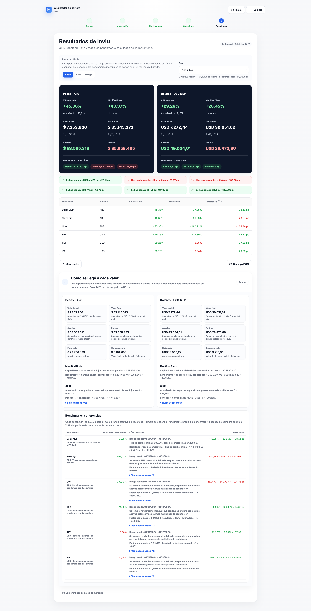

# Cartera Clara

Cartera Clara es una aplicacion web estatica para medir el rendimiento de una cartera de inversion a partir de dos tipos de datos:

- Movimientos externos de capital: aportes, depositos, retiros o extracciones.
- Snapshots: fotos del valor total de la cartera en fechas concretas.

Con esos datos calcula resultados en ARS y USD MEP, compara contra benchmarks y deja todo funcionando en el navegador, sin backend propio.



## Que hace

- Importa movimientos desde archivos XLSX mediante plugins de broker.
- Incluye plugins para Balanz e INVIU.
- Permite carga manual con CSV.
- Permite revisar, corregir y agregar movimientos despues de importar.
- Permite cargar snapshots de inicio o cierre del dia.
- Calcula rendimiento por XIRR y Modified Dietz.
- Encadena tramos cuando hay mas de dos snapshots.
- Convierte entre ARS y USD usando el tipo de cambio MEP diario cargado en SQLite.
- Compara la cartera contra Dolar MEP, plazo fijo, UVA, SPY, TLT e IEF.
- Permite filtrar resultados por año calendario, YTD o rango de años.
- Guarda las carteras en el `localStorage` del navegador.
- Exporta e importa backups JSON.

## Datos que necesita

### Movimientos

Un movimiento representa solo flujo externo de capital.

Tipos validos:

- `ingreso`: dinero que entra a la cartera.
- `retiro`: dinero que sale de la cartera.

Monedas validas:

- `ARS`
- `USD`

No deben cargarse como movimientos externos las operaciones internas del portfolio, por ejemplo compras, ventas, dividendos, rentas, cauciones, comisiones, conversiones MEP o ajustes. Esas operaciones cambian la composicion de la cartera, pero no el capital aportado por el inversor.

CSV manual minimo:

```csv
fecha,tipo,moneda,monto
2026-01-10,ingreso,ARS,100000
2026-02-15,retiro,USD,500
```

### Snapshots

Un snapshot es una foto del valor total de la cartera. Debe representar la cuenta o cartera completa que se quiere medir, no un activo individual.

Campos:

- Fecha.
- Moneda del valor total (`ARS` o `USD`).
- Momento del dia.
- Valor total.
- Etiqueta.

Necesitas al menos dos snapshots con valor para calcular rendimiento.

## Inicio del dia y cierre del dia

El momento del snapshot define si los movimientos de esa misma fecha quedan dentro o fuera del periodo.

`Inicio del dia` (`start_day`) significa que la foto fue tomada antes de los movimientos de esa fecha. Si el snapshot inicial es de inicio del dia, los ingresos y retiros de esa fecha se incluyen en el calculo. Si el snapshot final es de inicio del dia, los movimientos de esa fecha quedan fuera.

`Cierre del dia` (`end_day`) significa que la foto ya incluye todos los movimientos de esa fecha. Si el snapshot inicial es de cierre del dia, los movimientos de esa fecha quedan fuera porque ya estan dentro del valor inicial. Si el snapshot final es de cierre del dia, los movimientos de esa fecha se incluyen.

Regla practica:

- Para empezar un año, sirve un snapshot de cierre del `31/12` anterior o uno de inicio del `01/01`.
- Para cerrar un año, sirve un snapshot de cierre del `31/12` o uno de inicio del `01/01` siguiente.
- Si hubo aportes o retiros en la fecha del snapshot, elegi el momento correcto para evitar distorsiones.

## Como calcula

### Modified Dietz

Modified Dietz estima el rendimiento del periodo usando:

- Valor inicial.
- Valor final.
- Aportes y retiros.
- Peso temporal de cada flujo segun los dias que estuvo dentro del periodo.

Si hay snapshots intermedios, la aplicacion calcula cada tramo y encadena los resultados.

### XIRR

XIRR calcula una tasa anualizada que iguala a cero el valor presente neto de los flujos. La aplicacion tambien muestra el XIRR convertido al rendimiento efectivo del periodo.

### Monedas

Los resultados se calculan en:

- ARS.
- USD MEP.

Cuando un movimiento o snapshot esta en otra moneda, se convierte usando el tipo de cambio MEP diario disponible en `data/cartera_v4.sqlite`.

### Benchmarks

Los benchmarks usan el mismo rango efectivo del resultado seleccionado.

- Dolar MEP usa la variacion diaria de `exchange_rates`.
- Plazo fijo usa TNA mensual prorrateada por dias.
- UVA, SPY, TLT e IEF usan rendimientos mensuales ponderados por los dias activos de cada mes.

Los benchmarks mensuales se cortan en el ultimo mes publicado para evitar usar meses incompletos.

## Uso local

Requisitos:

- Node.js 24 o superior.

Comandos:

```bash
npm run build
npm run serve
```

El servidor local usa `http://127.0.0.1:3003/` por defecto. Para cambiar el puerto:

```bash
PORT=3077 npm run serve
```

## Publicacion

El sitio se publica como aplicacion estatica mediante GitHub Pages. El workflow de Pages construye `dist/`, verifica que el artefacto publico no contenga archivos privados y publica solo esa carpeta.

`build_sqlite.php` no debe exponerse. Esta ignorado por Git, no se copia a `dist/` y `npm run verify:public` falla si aparece en el artefacto publico.

Documentacion tecnica:

- [Plugins de importacion](docs/plugins.md)
- [SQLite de mercado](docs/sqlite.md)
- [Deploy y seguridad de publicacion](docs/deployment.md)

